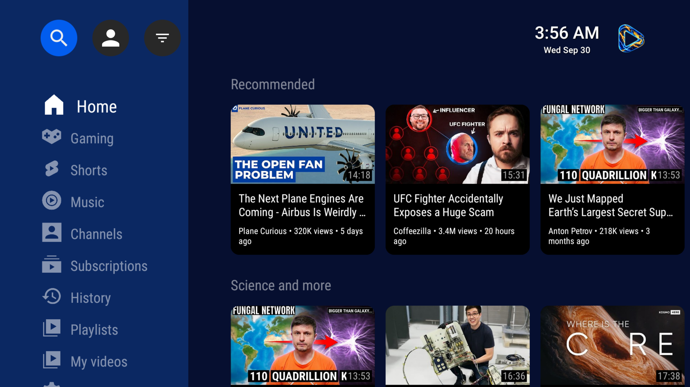

# Electric Eel
  
<!--  -->

Electric Eel is a fork of [SmartTube](https://github.com/yuliskov/SmartTube), and a free and open-source media client for Android TVs and TV boxes. It allows you to browse and play content from various public sources in a TV-optimized interface.

### Features
- Filtering of channels via AiSList's lists
- Hide shorts checkboxes for Sports, Live, My videos, Gaming, News and Music
- Hide videos older than setting with period, sections and quick toggle
- Shorts quick toggle
- Quick toggles button next to the account button
- Settings are per account by default
- Refactored Settings to use more cards
- Keyword filtering that hides videos by the words in their titles
- Full-screen word picker for keywords and a Hide words item to the context menu
- Blocking videos in different sections by category
- My videos a rows section with a Shorts row after the videos

### SmartTub Features
- Clean interface 
- SponsorBlock integration  
- Adjustable playback speed  
- 8K resolution support  
- 60fps playback  
- HDR compatibility  
- View live chat  
- Customizable buttons  
- Does not require Google Services  
- Helpful international community

### ❌ Limitations
- Not supported on phones and tablets  
- Comment functionality is unstable  
- Voice search and casting performance may be inferior to official apps, depending on your device  

## Device support
> [!IMPORTANT]  
> Starting in October 2025 new Amazon FireTV devices no longer run Android under the hood. Electric Eel will **not** be compatible with the Fire Stick 4k Select and newer devices which run Amazon's own VegaOS.

* **Supported:** all Android TVs and TV boxes (incl. All FireTV devices released before Oct. 2025, NVIDIA Shield & Chromecast with Google TV), even older ones with Android 4.3 (Kitkat).
* **Not supported:** Smartphones, non-Android platforms like Samsung Tizen, LG webOS, Apple TV, etc.

## Installation

The recommend method of installation the first time is to use [LocalSend](https://localsend.org/).

### Updating

The app has a built-in updater. You only need to follow the installation procedure **once**. A few seconds after launching Electric Eel, it will notify you if there is any update and also show a changelog. You can disable automatic update checks or manually update in the settings under `Settings | Updates`.

If the installation fails, either your **disk space is full** or the update didn't download correctly; clear up space and try updating again (_Settings > About > Check for updates_).

## Compatibility

Electric Eel requires Android 4.3 or above. It does not work on non-Android devices (incl. LG or Samsung TVs). On unsupported TVs, you can use a TV stick or TV box. Though this app technically runs on smartphones and tablets, it is not optimized for such and offers no official support!

It has been successfully tested on TVs, TV boxes and TV sticks that are based on Android, including:

- Android TVs & Google TVs (e.g. Philips, Sony)
- Chromecast with Google TV & TVs with _Chromecast built-in_
- Amazon FireTV stick (all generations)
- NVIDIA Shield
- TV boxes running Android (many cheap chinese no-name boxes)
- Xiaomi Mi Box

### SponsorBlock

Electric Eel includes optional SponsorBlock integration. From the [SponsorBlock website](https://sponsor.ajay.app/):

> SponsorBlock is an open-source crowdsourced browser extension and open API for **skipping sponsor segments** in YouTube videos. [...] the extension automatically skips sponsors **it knows about** using a privacy preserving query system. It also supports skipping **other categories**, such as intros, outros and reminders to subscribe [and non-music parts in music videos].

You can select which categories you want to skip in the settings. Unlike the browser addon, in Electric Eel you cannot submit new segments (TVs and TV remotes aren't great devices for such precise operations). Note that SponsorBlock is a free and voluntary project based on user submissions, so don't expect it to 100% work every time. Sometimes, sponsor segments are not yet submitted to the database, sometimes the SponsorBlock servers are offline/overloaded.

## Support

You can report in our Telegram group or via [issue tracker on Github](https://github.com/cygnusx-1-org/electriceel/issues) (account required).

- **Discord group**: [CygnusX-1.org](https://discord.gg/vDuSpJEDrW)  

## Donations

